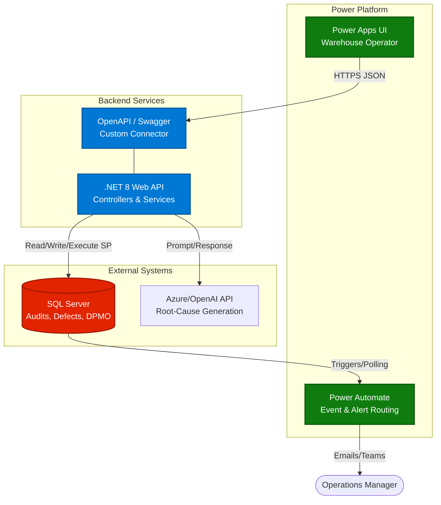

# Inventory Quality & Audit System (IQAS)

An enterprise-grade backend service designed to automate defect tracking, aggregate operational compliance metrics, and generate AI-driven root-cause analyses for warehouse and supply chain environments.

Built as a robust **.NET 8 Web API**, this system utilizes **SQL Server** for high-performance data aggregations and integrates with **OpenAI** to provide intelligent operational insights. It is designed to act as the core data engine for low-code frontends like **Power Apps** and automated workflows in **Power Automate**.

---

## Key Features

- **Automated AI Root-Cause Analysis:** Automatically generates concise executive summaries and remediation steps for logged defects using OpenAI (gpt-4o-mini).
- **High-Performance Metrics:** Leverages T-SQL Stored Procedures to calculate site-wide DPMO (Defects Per Million Opportunities) dynamically.
- **Relational Integrity:** Fully normalized SQL Server database managed via Entity Framework Core.
- **Clean API Architecture:** Utilizes Data Transfer Objects (DTOs) and handles circular object reference truncation for clean, flat JSON responses.
- **Low-Code Ready:** Exposes an OpenAPI/Swagger definition ready to be consumed by Power Platform Custom Connectors.

---

## Architecture Stack

- **Backend Framework:** C# / .NET 8.0 Web API
- **Database:** Microsoft SQL Server (T-SQL)
- **ORM:** Entity Framework Core (Code-First / DB-First hybrid)
- **AI Integration:** OpenAI SDK (`gpt-4o-mini`)
- **API Documentation:** Swashbuckle (Swagger/OpenAPI)
- **Target Frontend:** Power Apps Canvas Apps & Power Automate Webhooks

### System Architecture Diagram



---

## Prerequisites

* [.NET 8 SDK](https://dotnet.microsoft.com/download/dotnet/8.0)
* [SQL Server](https://www.microsoft.com/en-us/sql-server/sql-server-downloads) (Express, Developer, or LocalDB)
* Visual Studio 2022 (or VS Code)
* An OpenAI API Key (or Azure OpenAI endpoint)

---

## Local Setup & Installation

### 1. Database Setup

A T-SQL script is provided to generate the schema, stored procedures, and seed data.

1. Open SQL Server Management Studio (SSMS) or Visual Studio SQL Object Explorer.
2. Connect to your local SQL instance.
3. Execute the provided setup scripts (located in `/Database` or similar):
* `01_Schema.sql`
* `02_StoredProcedures.sql`
* `03_SeedData.sql`


### 2. Application Configuration

Clone the repository and open `IqasAutomationApi` in Visual Studio. Update the `appsettings.json` file with your specific database connection string and API keys:

```json
{
  "ConnectionStrings": {
    "DefaultConnection": "Server=localhost;Database=InventoryQualityDb;Trusted_Connection=True;TrustServerCertificate=True;"
  },
  "OpenAI": {
    "ApiKey": "sk-proj-YOUR_API_KEY_HERE"
  }
}

```

*(Note: Do not commit your actual API keys to version control).*

### 3. Run the Application

Press **F5** in Visual Studio, or run the following command in your terminal:

```bash
dotnet run

```

Navigate to `https://localhost:<port>/swagger` to access the interactive API documentation.

---

## API Endpoints

### 1. Get All Defects

`GET /api/QualityDefects`
Returns a flattened list of all recorded defects, joined with their parent Audit and Location data.

**Response:** `200 OK`

```json
[
  {
    "defectId": 1,
    "category": "Wrong Quantity",
    "severity": "Critical",
    "description": "Bin expected 50 units...",
    "aiSummary": "Discrepancy of 15 units detected...",
    "isResolved": false,
    "auditorName": "Auditor-A",
    "binCode": "A-101-1"
  }
]

```

### 2. Log a New Defect (Triggers AI)

`POST /api/QualityDefects`
Logs a defect to the database. If a `description` is provided, the API automatically queries OpenAI to generate an `aiSummary` (Bridge Report) before saving.

**Request Body:**

```json
{
  "auditId": 1,
  "category": "Damaged Packaging",
  "severity": "High",
  "description": "Forklift blade punctured double-walled corrugated box.",
  "isResolved": false
}

```

### 3. Calculate Site Defect Rate (DPMO)

`GET /api/QualityDefects/calculate-rate?startDate={date}&endDate={date}`
Executes the `sp_CalculateDefectRate` stored procedure to calculate Defects Per Million Opportunities.

**Response:** `200 OK`

```json
{
  "startDate": "2026-01-01T00:00:00",
  "endDate": "2026-12-31T00:00:00",
  "defectRateDpmo": 1750.00
}

```

---

## Power Platform Integration Note

To consume this API in Power Apps or Power Automate:

1. Run the API locally or deploy to Azure App Service.
2. Download the Swagger JSON file via the Swagger UI.
3. Import the file into Power Apps under **Custom Connectors**.
4. Use `IqasApiConnector.GetAllDefects()` directly in your Canvas App `ClearCollect()` functions.

---
